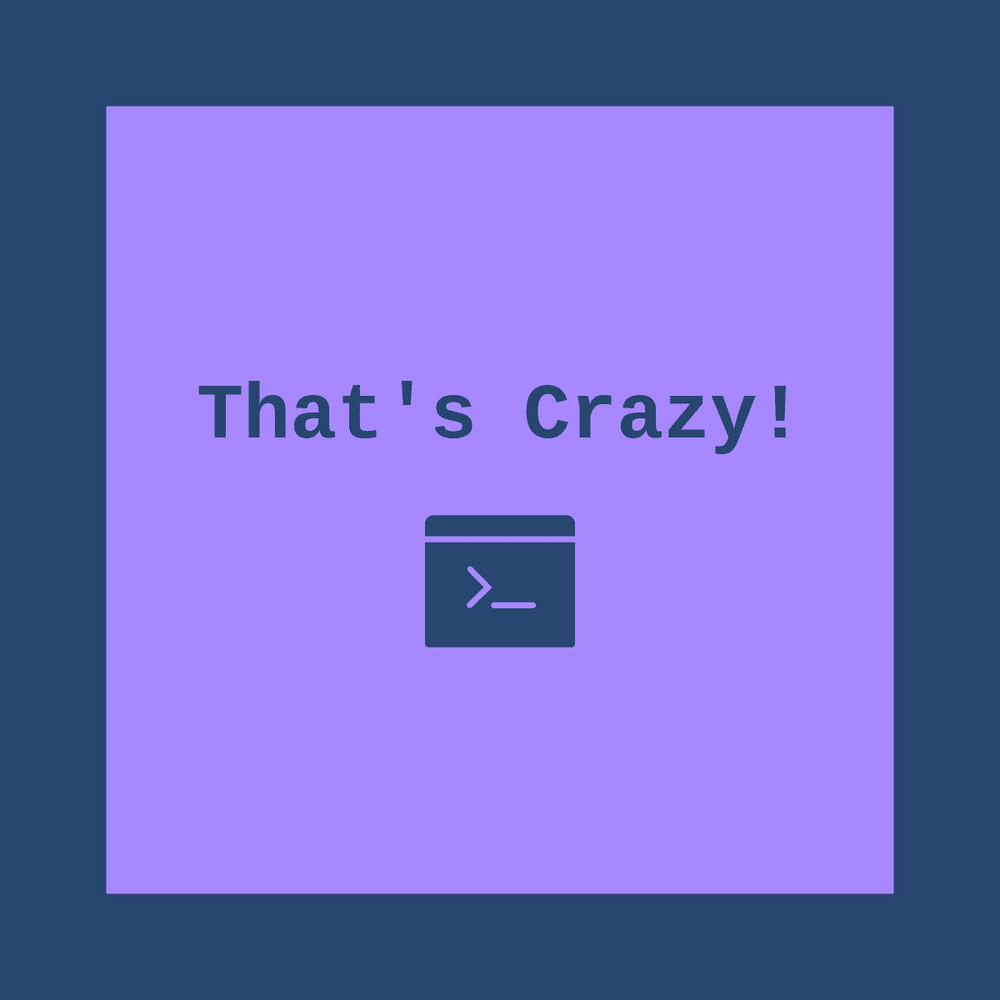

<p align="center">

</p>

# That's Crazy!
CLI program using speech recognition and NLP to summarize text, generate freestyle song lyrics, and create blog posts, THAT'S CRAZY!

## How To Use
- NOTE: Make sure you have Python 10 installed, as well as pip configured.

- First, clone the repo locally using
```git clone https://github.com/SherRao/ThatsCrazy```

- Next, install all the dependencies using pip
```pip install -r requirements.txt```
OR
```pip3 install -r requirements.txt```

- Finally, use the help command to see a list of commands.
```python main.py --help```
OR
```python3 main.py --help```

## Our Submission
This project was made for HackTheNorth 2022 - you can view our [Devpost submission here](https://devpost.com/software/get-to-the-point)
